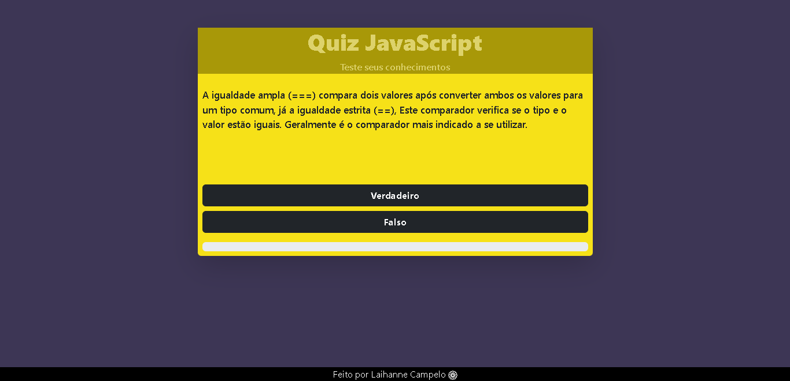

# Quiz JavaScript
<p align="center">Quiz baseado nas perguntas que mais caem em processos seletivos de JS.</p>
<h4 align="center"> Status do projeto: concluído.</h4>

### Tabela de conteudo

<p align="center">
<a href="#funcionalidades">funcionalidades</a> • 
<a href="#Demostração-da-Aplicação">Demostração</a> • 
<a href="#Como-executar-o-projeto">como Executar</a> • 
<a href="#Tecnologias-utilizadas">Tecnologias</a> •   
<a href="#autor">Autor</a> •
<a href="#licenc-a">Licença</a> 
</p>

### funcionalidades

- [x] Exibir as perguntas 
- [x] Armazenar as perguntas em um array de objetos
- [x] Verificar a resposta
- [x] Deixar as perguntas em modo aleatório

### Demostração da Aplicação
* Ler a perguntas;
* Selecionar o botão de resposta;
<a href="https://laihanne.github.io/Quiz-JS/">Teste o projeto</a>



### Como executar o projeto

Antes de começar, você vai precisar ter instalado em sua máquina as seguintes ferramentas:

Além disto é bom ter um editor para trabalhar com o código como [VSCode](https://code.visualstudio.com/)

```bash
# Clone este repositório
$ git clone <>

# Acesse a pasta do projeto no terminal/cmd
$ cd ...

# Execute a aplicação 
$ index.html ou server live(plugin do vscode)

```
            

### Tecnologias utilizadas

* HTML
* JavaScript
* CSS
* Bootstrap

### Autor
Feito com ❤️ por Laihanne Campelo 👋🏽 Entre em contato!

email: laihanne.campelo@gmail.com

### Licença
MIT License
